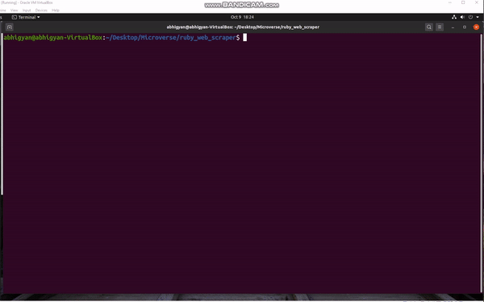

# ruby_web_scraper

> This program's purpose is to scan a webpage and take relevant data from it. This project provides useful meditation tips to further enhance someone's meditation skill.

In this project, user will find 10 best tips for meditation beginners.

## Built With

- Ruby
- Nokogiri
- open-uri
- Rubocop

## App work flow

- The app has a welcome screen, which has an introduction to meditation.
- User is asked to enter any number between 1 to 10 for meditation tips.
- If the input provided by the user is not between 1 to 10, then the user is again asked for the input.
- If the input provided by the user is between 1 to 10, then the meditation tip and details are displayed.

### How_to_use



### Prerequisites

To get this project up and running locally, you should have Ruby installed.

### Setup

Step 1: Clone the repository

```
'git clone https://github.com/Abhigyan001/ruby_web_scraper'
```

Step 2: Move into the project directory

```
'cd ruby_web_scraper'
```

Step 3: Install necessary dependencies

```
'bundle install'
```

Step 4: Run the app

```
'bin/webscraper.rb'
```

### Testing

Simply run rspec from the root directory

## Author

👤 **Abhigyan Mahanta**

- Github: [@Abhigyan001](https://github.com/Abhigyan001)
- Twitter: [@abhigyan_001](https://twitter.com/abhigyan_001)
- Linkedin: [Abhigyan Mahanta](https://www.linkedin.com/in/abhigyan-mahanta-b49799145/)

## 🤝 Contributing

Contributions, issues, and feature requests are welcome!

Feel free to check the [issues page](issues/).

## Show your support

Give a ⭐️ if you like this project!

## Acknowledgments

- Microverse

## 📝 License

This project is [MIT](lic.url) licensed.
